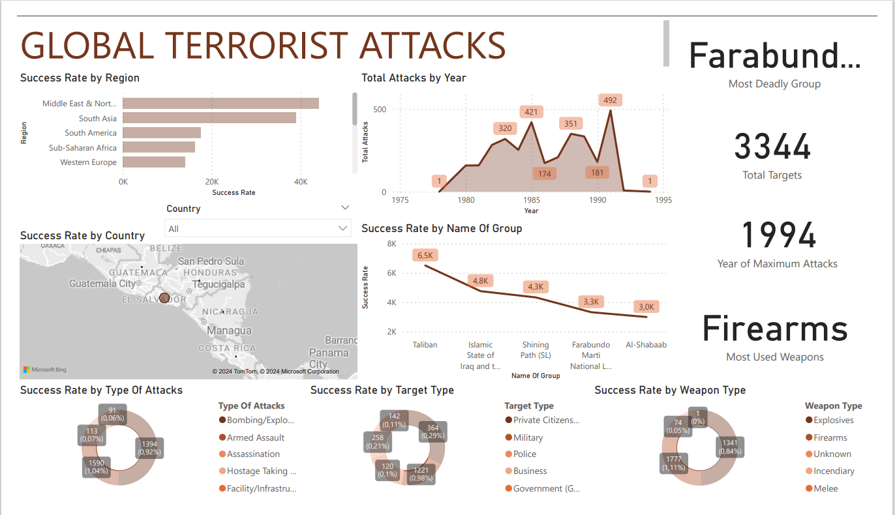

# Task-2-InternCareer-Global-Terrorist-Dataset
## 1. Data Preparation:
### - Importing the Terrorism Database into Power BI:
- The Terrorism Database has been imported into Power BI to begin the analysis process.
### - Data Cleaning and Handling Missing Values:
- Missing values and outliers have been addressed to ensure data integrity and accuracy.
### - Data Types Validation:
- Data types have been correctly assigned to each field to facilitate analysis.
## 2. Data Visualization:
### - Number of Terrorist Attacks Over Time:
- Visualizations have been created to display the frequency of terrorist attacks over time, providing insights into historical trends.
### - Attack Locations Visualized on a Map:
- Geographic locations of attacks have been plotted on a map to provide a spatial understanding of terrorist activities.
### - Analysis of Attack Types and Weapons Used:
- Trends in attack types and weapons used have been analyzed through visualizations to identify patterns and insights.
### - Comparison of Casualties by Region or Year:
- Visualizations allow for the comparison of casualties across different regions or years, highlighting areas of concern.
## 3. Interactive Dashboard:
### - Interactive Features Implemented:
- An interactive dashboard has been developed with slicers, filters, and drill-through options to empower users to explore the data dynamically.
### - Dynamic Data Exploration:
- Users can delve into various aspects of global terrorism trends and patterns by interacting with the dashboard.
### - Insights Highlighted:
- Insights and trends are highlighted within the visualizations to provide users with actionable information.
## 4. Narrative and Insights:
### - Key Findings Narrative:
- A brief narrative provides an overview of key findings from the analysis, offering insights into global terrorism trends.
### - Summary of Most Affected Regions and Impact Over Time:
- The readme includes a summary of the most affected regions and the evolving impact of terrorism over time based on the analysis.
## 5. User-Friendly Design:
### - User-Friendly Dashboard:
- The dashboard is designed to be user-friendly and intuitive, with clear visualizations and interactive elements.
### - Appropriate Color Schemes and Layouts:
- Color schemes and layouts have been chosen carefully to enhance clarity and ease of use for the end-user.
  
## Visual Representation of Analysis:

### Analysis Conclusion:

### - The analysis of the Terrorism Database reveals significant insights into global terrorism trends. Key findings include:
- Success rates vary by type of attacks, target types, weapon types, countries, regions, and the names of terrorist groups.
- The frequency of terrorist attacks has fluctuated over time, with certain years experiencing higher activity than others.
- Certain regions have been disproportionately affected by terrorism, with casualties varying across different geographical areas.
- Interactive features empower users to explore the data dynamically and gain deeper insights into global terrorism patterns.

## Author:
### Gabriel Mokhele

